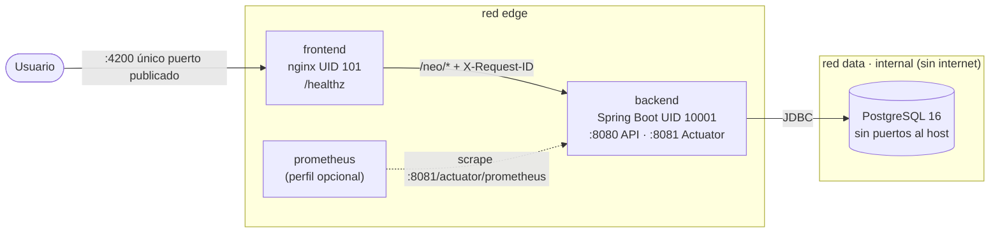
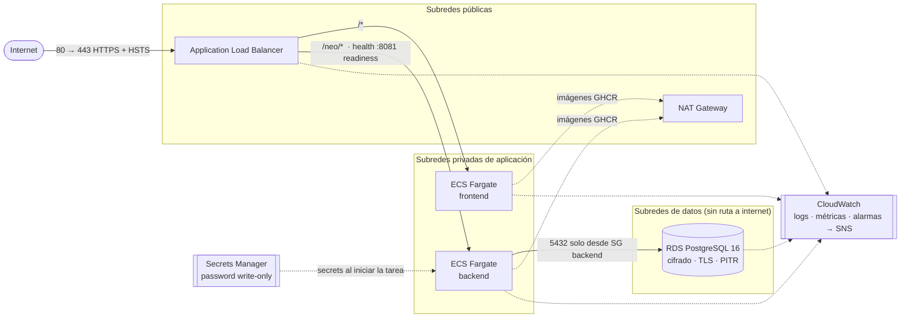
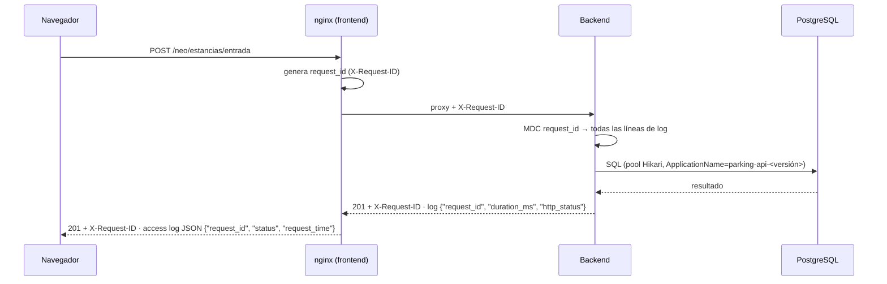
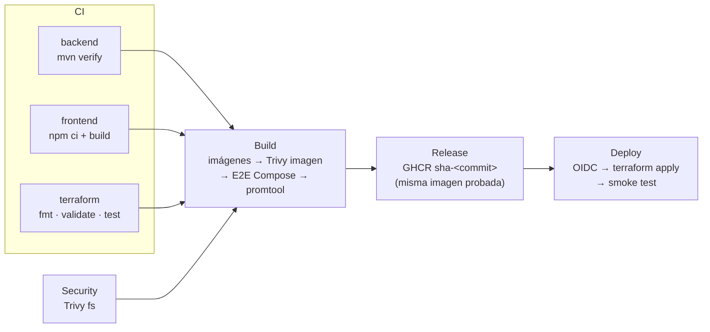

# Arquitectura y decisiones

Principio de diseño: **simplicidad > seguridad > mantenibilidad > automatización**. Cada componente existe porque resuelve un requisito concreto de la prueba; lo que no lo hace, no está.

## 1. Componentes

### Local (Docker Compose)



### AWS (Terraform)



### Recorrido de una petición y correlación



| Componente | Local (Docker Compose) | AWS (Terraform) |
|---|---|---|
| Entrada pública | nginx en `:4200` | ALB en 80/443 (HTTPS + HSTS con certificado) |
| Frontend | nginx-unprivileged 1.30 (UID 101) | ECS Fargate, subred privada |
| Backend | Temurin 17 JRE (UID 10001) | ECS Fargate, subred privada |
| Base de datos | postgres:16 en red `internal` | RDS PostgreSQL 16, subred sin ruta a internet |
| Secretos | `.env` fuera de Git | Secrets Manager (password efímero write-only) |
| Métricas/alertas | Prometheus (perfil opcional) | CloudWatch + SNS |
| Logs | JSON en stdout (`docker compose logs`) | CloudWatch Logs |

### Red y exposición

| Qué | Local | AWS |
|---|---|---|
| Público | frontend `:4200` | ALB 80/443 |
| Interno | backend `:8080` (solo desde nginx), `:8081` (solo red Docker) | backend 8080/8081 solo desde el SG del ALB |
| Aislado | PostgreSQL en red `data` (`internal: true`, sin salida a internet) | RDS solo desde el SG del backend; subred sin ruta a internet |

## 2. Decisiones técnicas

### D1. Cómputo en AWS
| | Opción A: ECS Fargate + ALB | Opción B: EC2 + Docker Compose |
|---|---|---|
| Ventajas | Sin servidores que parchear; health checks del ALB; rollback automático (circuit breaker); escala por servicio | Mismo `docker-compose.yml` que en local; menos código Terraform |
| Desventajas | Más recursos (ALB, NAT, módulo ECS) | SO propio que parchear, un solo punto de falla, deploy por SSH/SSM |
| Complejidad | Media | Baja |

**Recomendación: A.** Para producción, el costo extra de Terraform se paga con operación más simple: AWS parchea y reinicia, el ALB saca tareas enfermas y un despliegue fallido vuelve solo a la versión anterior.

### D2. Base de imagen del backend
| | A: `eclipse-temurin:17-jre-noble` | B: `17-jre-alpine` / distroless |
|---|---|---|
| Ventajas | Multi-arquitectura (CI amd64 y Mac arm64); trae `curl` para el health check | Más pequeña |
| Desventajas | ~270 MB | Alpine de Temurin 17 es solo amd64; distroless no tiene shell (sin `HEALTHCHECK` simple) |

**Recomendación: A** ahora; distroless o jlink como mejora.

### D3. Password de la base de datos en AWS
| | A: `manage_master_user_password` (RDS) | B: password efímero + write-only |
|---|---|---|
| Ventajas | Una línea; RDS lo genera | Nunca en el state; rotación cuando **nosotros** decidimos |
| Desventajas | RDS lo **rota cada 7 días**; ECS inyecta el secreto solo al arrancar la tarea → caída de autenticación tras la rotación | Requiere Terraform ≥ 1.11 y rotación manual (`db_password_version`) |

**Recomendación: B.** Una rotación automática que tumba la aplicación es peor que una rotación planeada. Se documenta la ruta enterprise: AWS JDBC Wrapper, que relee el secreto sin reiniciar.

### D4. Release: reconstruir o promover
| | A: reconstruir en release | B: promover la imagen probada |
|---|---|---|
| Ventajas | Un job más simple | Lo publicado es **exactamente** lo que pasó Trivy y el E2E |
| Desventajas | El artefacto publicado ≠ el probado | Artefacto temporal (`docker save`) entre jobs |

**Recomendación: B.**

### D5. Observabilidad
| | A: Prometheus (+ CloudWatch en AWS) | B: Prometheus + Grafana + Loki |
|---|---|---|
| Ventajas | Métricas, reglas de alerta y consultas con lo mínimo | Paneles bonitos |
| Desventajas | Sin paneles | 2–3 servicios más que operar sin aportar a los requisitos |

**Recomendación: A.** La prueba pide métricas, alertas y una consulta de ejemplo; la UI de Prometheus basta. En AWS se usan las métricas nativas de ALB/RDS/ECS sin instalar nada.

### D6. Secretos en local
| | A: `.env` fuera de Git | B: Docker secrets (archivos en `/run/secrets`) |
|---|---|---|
| Ventajas | Estándar, simple | No aparece en `docker inspect` |
| Desventajas | Visible con `docker inspect` en la propia máquina | Cambios en la app (`configtree`) y en el flujo |

**Recomendación: A** para local; en AWS el secreto viene de Secrets Manager.

### D7. Versión de Spring Boot
3.3.5 estaba fuera de soporte OSS (toda la línea 3.x terminó el 30-jun-2026). **Se sube a 3.5.16** (último parche 3.x, cambio de una línea, trae logs JSON nativos). Migrar a 4.x es un cambio de aplicación fuera del alcance DevOps y queda como riesgo documentado.

### D8. Escaneo de seguridad
**Solo Trivy**: dependencias, secretos, misconfiguración (Dockerfile, Terraform) e imágenes, con una configuración compartida (`trivy.yaml`) en local y en CI. SonarCloud requiere cuenta y token externos y, con 7 tests unitarios, aporta poco en 5 horas.

## 3. Lo que NO se usa y por qué

| Herramienta | Motivo |
|---|---|
| Kubernetes / Helm / ArgoCD | ECS Fargate cubre despliegue, health checks y rollback sin operar un cluster ni GitOps |
| Jenkins | GitHub Actions ya está donde está el código |
| Vault | GitHub Secrets/OIDC y AWS Secrets Manager cubren el caso |
| Grafana / Loki | Ver D5 |
| SonarCloud | Ver D8 |
| Ansible | No hay servidores que configurar (contenedores + servicios gestionados) |
| hadolint / checkov / tfsec | Trivy ya revisa Dockerfile y Terraform |
| SBOM / firma de imágenes | Valiosas, pero no requeridas; quedan como mejora |

<a id="cicd"></a>
## 4. CI/CD

Archivo único: `.github/workflows/pipeline.yml`.



Release solo corre en `main` y en tags `v*`. Deploy: `main` → dev; tag `v*` → production con aprobación.

| Etapa | Job | Qué valida | Si falla |
|---|---|---|---|
| CI | `backend` | `mvn verify` (tests + JAR), Java 17, caché Maven | No hay build |
| CI | `frontend` | `npm ci` (lockfile exacto) + build de producción con budgets, Node 22, caché npm | No hay build |
| CI | `terraform` | `fmt -check`, `init -backend=false`, `validate`, `test` (plan simulado) | No hay build |
| Security | `security` | Trivy fs: dependencias npm, secretos, misconfig de Dockerfile y Terraform. Gate: HIGH/CRITICAL con parche. Las dependencias Java se escanean en la imagen (job `build`) | No hay build |
| Build | `build` | Imágenes (caché gha) → Trivy de imágenes → E2E con Compose → pruebas de alertas | No hay release |
| Release | `release` | Solo `main`/tags: etiqueta y sube a GHCR **las mismas imágenes** | No hay deploy |
| Deploy | `deploy` | OIDC → `terraform plan/apply` con `image_tag=sha-<commit>` → smoke test | ECS vuelve solo a la versión anterior |

**Mínimo privilegio:** el workflow tiene `contents: read` por defecto; `packages: write` solo en release e `id-token: write` solo en deploy. Las actions están fijadas por SHA y el checkout no persiste credenciales.

**Versionado de imágenes** (`ghcr.io/<owner>/<repo>/parking-{backend,frontend}`):
- `sha-<7 chars>`: inmutable; es el tag que se despliega y el que se usa para rollback.
- `X.Y.Z`: al publicar un tag `vX.Y.Z`.
- `main`: referencia al último build de main (nunca se despliega por ese tag).

**Caché:** Maven (`setup-java`), npm (`setup-node`), capas Docker (`type=gha`) y base de datos de Trivy. Ninguna cachea resultados de tests ni artefactos finales, así que no compromete la reproducibilidad.

### Configuración en GitHub (una vez)
1. *Settings → Branches*: proteger `main` (PR obligatorio, 1 aprobación, checks `CI · backend`, `CI · frontend`, `CI · terraform`, `Security · Trivy`, `Build · imágenes + escaneo + E2E`).
2. *Settings → Environments*: `dev` y `production` (esta última con *required reviewers*). En cada una, las variables `AWS_DEPLOY_ROLE_ARN` (output `github_deploy_role_arn`), `AWS_REGION` y `TF_STATE_BUCKET`.
3. Variable de repositorio `DEPLOY_ENABLED=true` cuando exista la cuenta AWS.

### Checklist CI/CD
- [x] Se ejecuta en cada Pull Request, en `main` y en tags `v*`
- [x] Tests del backend antes de construir imágenes
- [x] Instalación reproducible del frontend (`npm ci`)
- [x] Escaneo de dependencias, secretos e IaC como gate
- [x] Escaneo de imágenes como gate
- [x] Prueba E2E del stack real antes de publicar
- [x] Lo publicado = lo probado (sin reconstrucción)
- [x] Tags inmutables por commit
- [x] Permisos mínimos por job; sin secretos impresos
- [x] Deploy solo tras todos los gates; producción con aprobación
- [x] Providers con hashes fijados (`infra/terraform/.terraform.lock.hcl`)

## 5. Branching

Trunk-based sencillo, sin GitFlow (no hay releases paralelas que mantener):

```text
feature/* ──PR (pipeline verde + review)──► main ──tag vX.Y.Z──► release a producción
```

## 6. Terraform

| Archivo | Recursos |
|---|---|
| `network.tf` | VPC 2 AZ, subredes public/app/data, IGW, NAT (1 en dev, 1 por AZ en prod) |
| `security_groups.tf` | Internet → ALB → tareas → RDS, encadenados por referencia entre SGs |
| `alb.tf` | ALB, target groups con health checks, HTTP→HTTPS, HSTS, regla `/neo/*` |
| `ecs.tf` + `modules/ecs-service` | Cluster, roles de ejecución y de tarea, servicios con circuit breaker |
| `rds.tf` | PostgreSQL 16 cifrado, TLS obligatorio, backups + PITR, secreto write-only |
| `monitoring.tf` + `kms.tf` | Alarmas → SNS cifrado con CMK |
| `iam_github.tf` | Rol OIDC para el pipeline: solo puede desplegar una nueva imagen |
| `environments/*.tfvars` | Diferencias entre dev y production (tamaño, HA, HTTPS, retención) |

State: S3 cifrado con `use_lockfile` (bloqueo nativo, sin DynamoDB); un state por ambiente (`parking/<env>/terraform.tfstate`).
